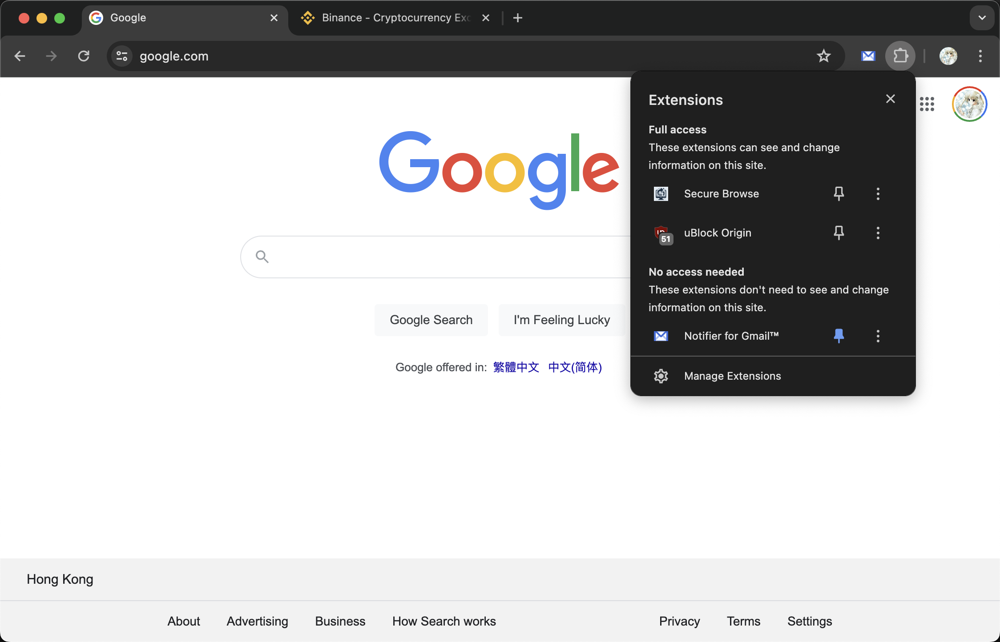
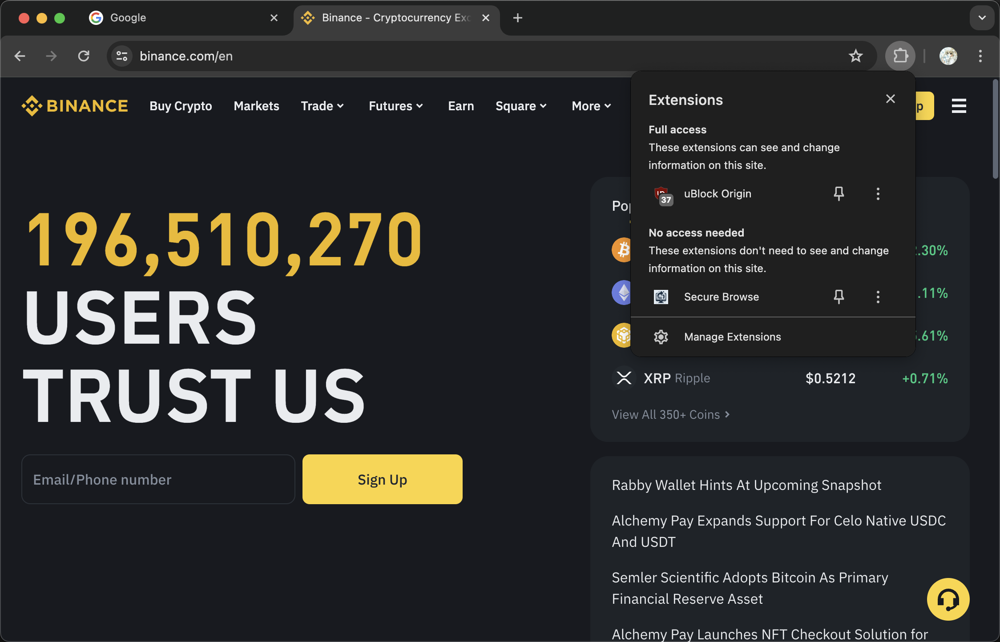

# Secure Browse

## 概述

**Secure Browse** 是一款 Chrome 扩展，旨在通过根据您访问的网站来管理其他扩展，从而增强您的在线安全性。该扩展在您访问金融网站时会自动禁用不在白名单中的扩展，从而确保更安全的浏览体验。当您离开这些网站时，它会重新启用之前禁用的扩展。

## 功能

- **自动扩展管理**：在访问金融网站时自动禁用潜在不安全的扩展。
- **自定义白名单**：维护一个可信扩展的白名单，使其在金融网站上保持启用。
- **无缝浏览**：当您离开金融网站时，扩展会重新启用。
- **用户友好**：无需手动干预；扩展在后台静默运行。

## 当前白名单

以下扩展包含在默认白名单中，并在您访问金融网站时保持启用：

- **uBlock Origin: cjpalhdlnbpafiamejdnhcphjbkeiagm**

## 支持的金融网站

该扩展当前监控并保护您在以下金融网站上的浏览：

- `*.binance.com`
- `*.coinbase.com`
- `*.kraken.com`

## 安装

1. **下载扩展**：从仓库克隆或下载扩展。
2. **加载扩展**：
   - 打开 Chrome 并导航到 `chrome://extensions/`。
   - 通过切换右上角的开关启用开发者模式。
   - 点击“加载已解压的扩展程序”，选择扩展目录。

## 贡献

我们欢迎社区的贡献！如果您有新的功能建议或改进意见，请提交拉取请求或打开问题。

## 许可证

该项目采用 MIT 许可证。详情请参阅 [LICENSE](LICENSE) 文件。

## 支持

如果您遇到任何问题或有任何疑问，请在 GitHub 仓库中打开问题。

## 截图

## 联系方式

如有任何疑问，请通过 [rxliuli@gmail.com](mailto:rxliuli@gmail.com) 联系我们。

---

通过使用 **Secure Browse**，您可以确保在金融网站上拥有更安全和更可靠的浏览体验。立即下载并安装，以便更好地控制您的 Chrome 扩展！
